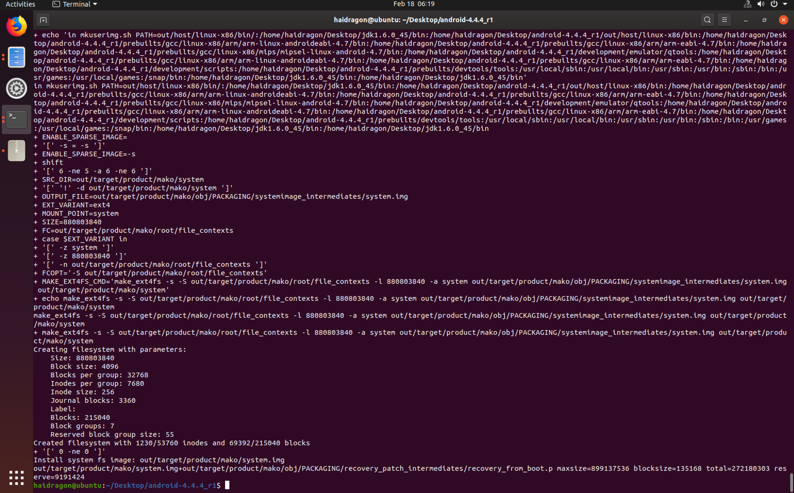
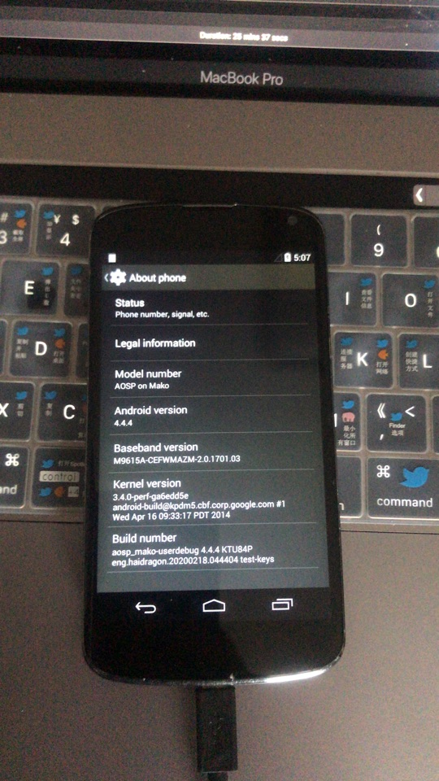
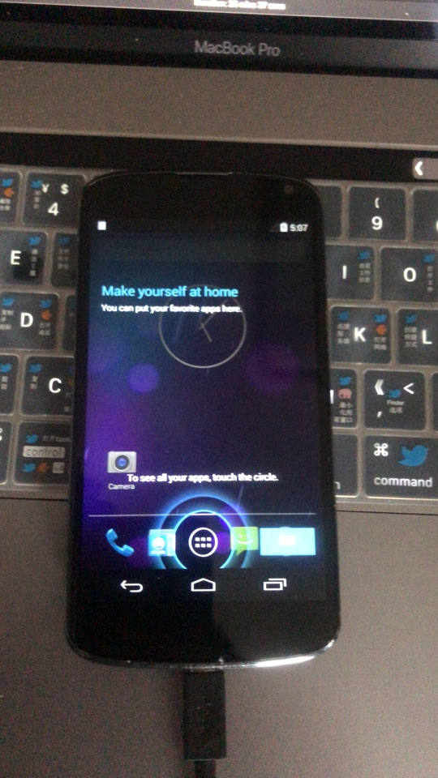

# 第二课 android 4版本源码编译
# 环境 ubuntu19.10 64位

* 安装jdk6 链接: https://pan.baidu.com/s/1miVKUHq 密码: y26k 添加环境变量(我喜欢临时的,因为有多个）
```
export CLASSPATH='/home/haidragon/Desktop/jdk1.6.0_45/lib'

export JAVA_HOME='/home/haidragon/Desktop/jdk1.6.0_45'

export PATH=$PATH:'/home/haidragon/Desktop/jdk1.6.0_45/bin'
```
* 安装依赖项
```
sudo apt-get install -y git git-core gnupg flex bison gperf build-essential zip curl zlib1g-dev libc6-dev 
sudo apt-get install -y lib32ncurses5-dev x11proto-core-dev libx11-dev 
sudo apt-get install -y lib32z-dev libgl1-mesa-dev g++-multilib tofrodos python-markdown 
sudo apt-get install -y libxml2-utils xsltproc gcc-multilib 
```
* 卸载(或者[共存](https://blog.csdn.net/xrinosvip/article/details/81177873))gcc g++ 安装 [g++4.9、gcc4.9](https://blog.csdn.net/yizhang_ml/article/details/86750405)  [apt问题](https://blog.csdn.net/maliao1123/article/details/52881856)
```
sudo apt-get remove g++
sudo apt-get remove gcc
安装之前要添加俩个源
deb http://dk.archive.ubuntu.com/ubuntu/ xenial main
deb http://dk.archive.ubuntu.com/ubuntu/ xenial universe
sudo apt update
sudo apt install g++-4.9
sudo apt install gcc-4.9
sudo apt reinstall gcc-4.9 g++-4.9
sudo update-alternatives --install /usr/bin/gcc gcc /usr/bin/gcc-4.9 100
sudo update-alternatives --install /usr/bin/gcc gcc /usr/bin/gcc-4.9 100
gcc -v
```
*  安装[make3.8.2](http://ftp.gnu.org/gnu/make/)[报错
/home/haidragon/Desktop/make-3.82/glob/glob.c:1362: undefined reference to `__alloca'](https://blog.csdn.net/Niklaus_Lee/article/details/84991444)

```
./configure
make  
报错
/home/haidragon/Desktop/make-3.82/glob/glob.c:1362: undefined reference to `__alloca'
//#if !defined __alloca && !defined __GNU_LIBRARY__
....
//#endif
```
准备对应的[官方驱动配置脚本](https://developers.google.com/android/drivers#mako)(因为我们没有编译内核直接用官方编译的),Nexus 4 binaries for Android 4.4.4 (KTU84P)

source build/envsetup.sh

lunch

/home/haidragon/Desktop/make-3.82/make -j4

# 刷入(记得双清下)  [fashboot 命令](https://blog.csdn.net/s13383754499/article/details/82755012)
```
export PATH=$PATH:/Users/haidragon/Library/Android/sdk/platform-tools
adb devices
adb reboot bootloader
export ANDROID_PRODUCT_OUT=./
echo $ANDROID_PRODUCT_OUT
fastboot flashall -w
```
```
haidragon@liuhailongdeMacBook-Pro mei_yun_xing_driver_sh % ls
android-info.txt        kernel                recovery.img
boot.img            previous_build_config.mk    system.img
clean_steps.mk            ramdisk-recovery.img
installed-files.txt        ramdisk.img
haidragon@liuhailongdeMacBook-Pro mei_yun_xing_driver_sh % fastboot flashall -w         
--------------------------------------------
Bootloader Version...: MAKOZ30d
Baseband Version.....: M9615A-CEFWMAZM-2.0.1701.03
Serial Number........: 047e3631ce95b902
--------------------------------------------
Checking 'product'                                 OKAY [  0.001s]
Sending 'boot' (6370 KB)                           OKAY [  0.227s]
Writing 'boot'                                     OKAY [  0.324s]
Sending 'recovery' (6918 KB)                       OKAY [  0.246s]
Writing 'recovery'                                 OKAY [  0.384s]
Sending 'system' (265401 KB)                       OKAY [  9.779s]
Writing 'system'                                   OKAY [ 16.356s]
Erasing 'userdata'                                 OKAY [  1.527s]
mke2fs 1.45.4 (23-Sep-2019)
Creating filesystem with 3449600 4k blocks and 863264 inodes
Filesystem UUID: 3ab015f7-b4ec-4753-bd69-1eff3c7c2c73
Superblock backups stored on blocks: 
    32768, 98304, 163840, 229376, 294912, 819200, 884736, 1605632, 2654208

Allocating group tables: done                            
Writing inode tables: done                            
Creating journal (16384 blocks): done
Writing superblocks and filesystem accounting information: done   

Sending 'userdata' (3496 KB)                       OKAY [  0.117s]
Writing 'userdata'                                 OKAY [  0.175s]
Erasing 'cache'                                    OKAY [  0.052s]
mke2fs 1.45.4 (23-Sep-2019)
Creating filesystem with 143360 4k blocks and 35840 inodes
Filesystem UUID: ba01f6b8-b683-4273-ab6a-21951cc3862a
Superblock backups stored on blocks: 
    32768, 98304

Allocating group tables: done                            
Writing inode tables: done                            
Creating journal (4096 blocks): done
Writing superblocks and filesystem accounting information: done

Sending 'cache' (208 KB)                           OKAY [  0.009s]
Writing 'cache'                                    OKAY [  0.018s]
Rebooting                                          OKAY [  0.002s]
Finished. Total time: 30.661s
haidragon@liuhailongdeMacBook-Pro mei_yun_xing_driver_sh % 
```



