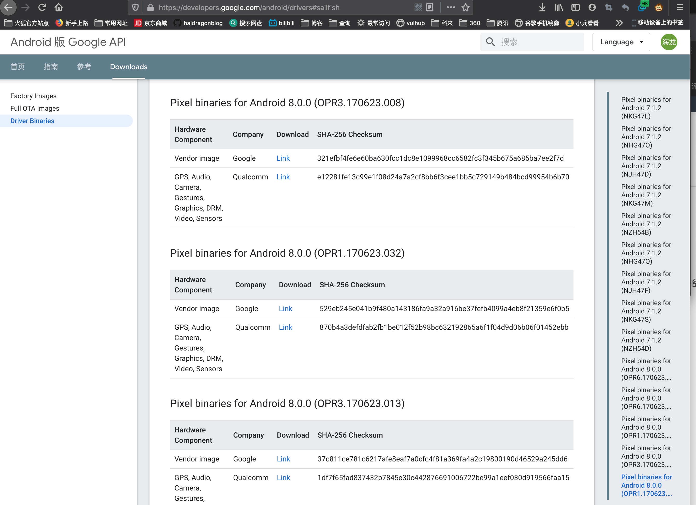
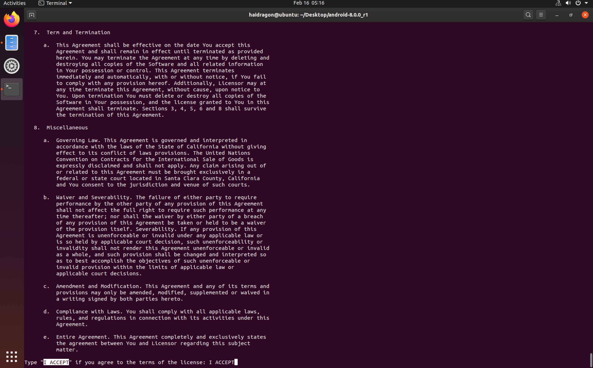
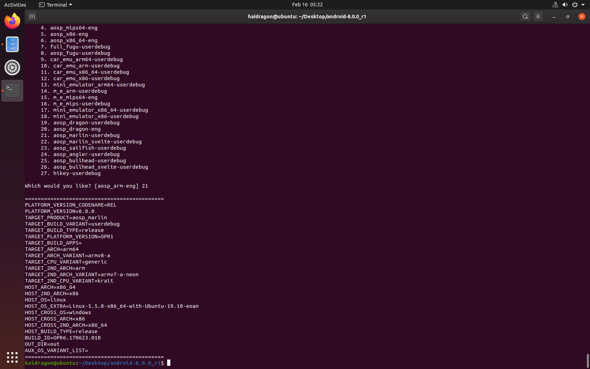
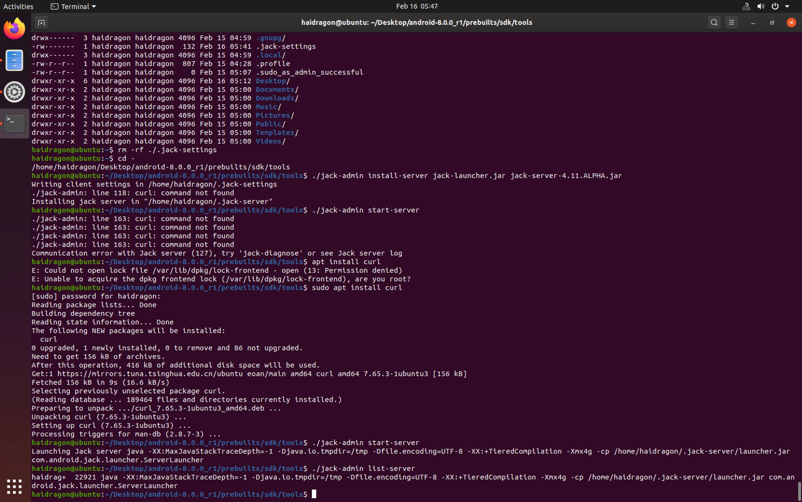
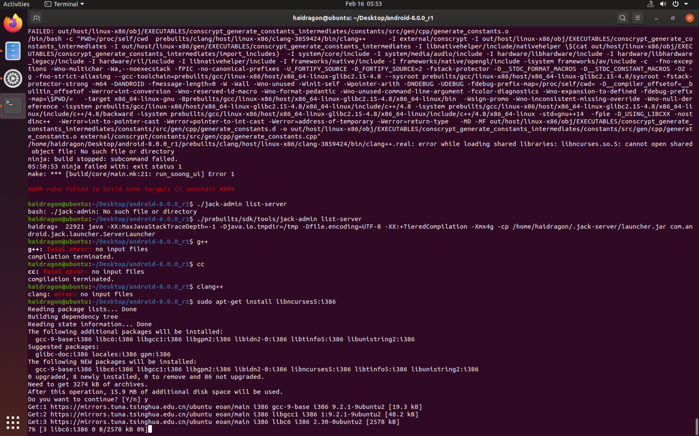
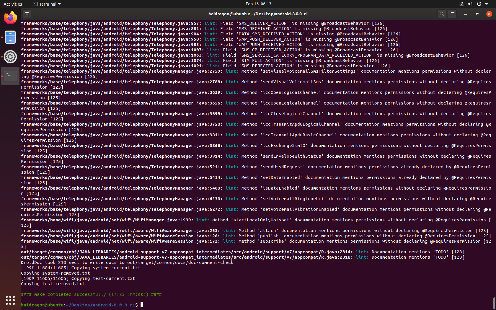
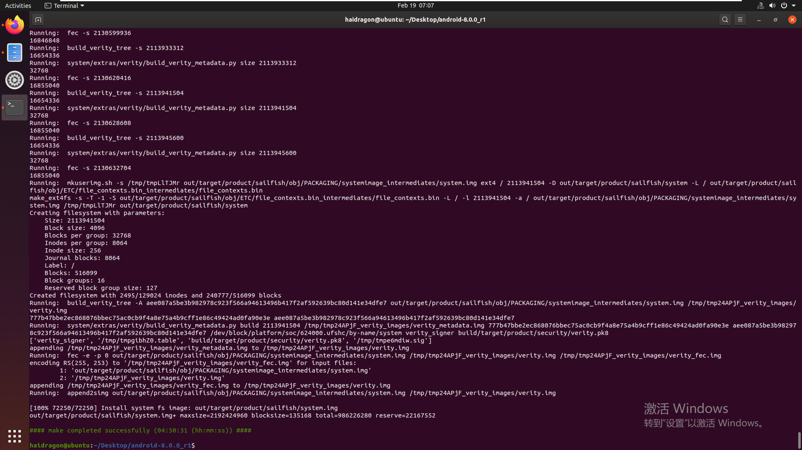
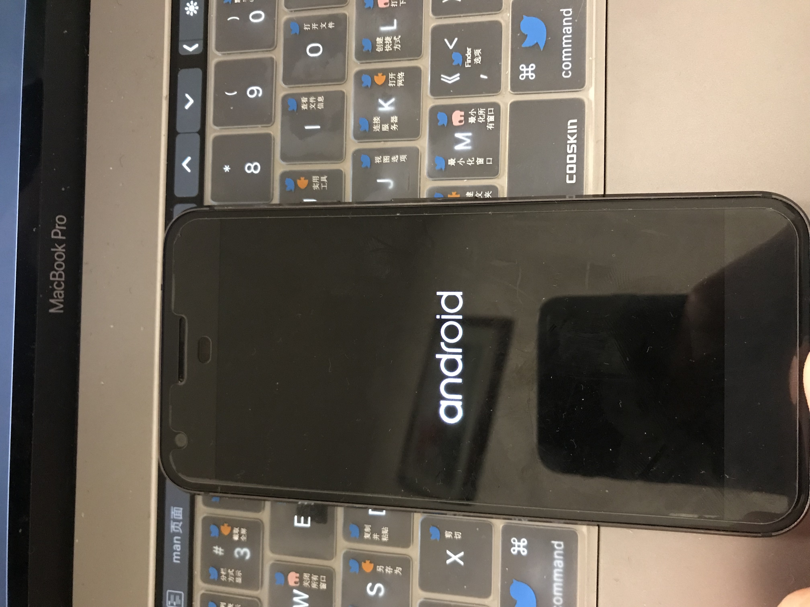
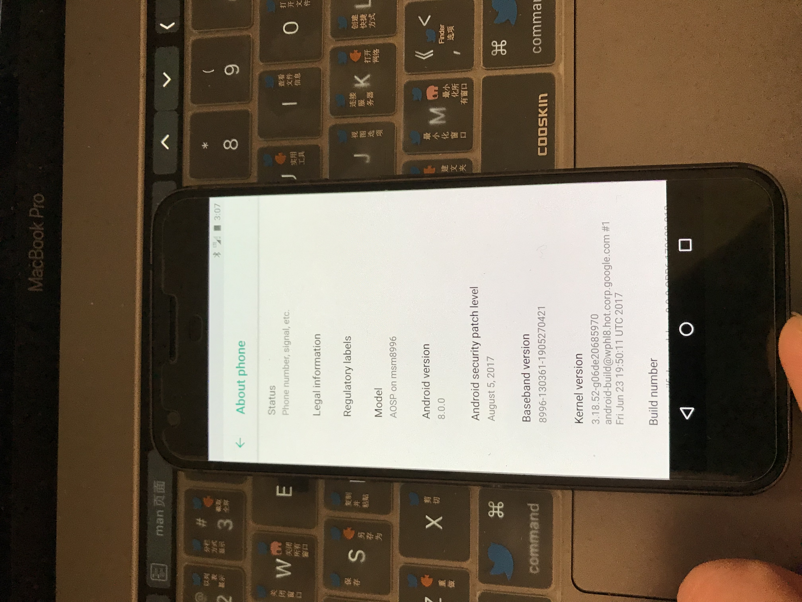

# 第四课 android 8版本源码编译与Pixel刷机

* 环境

```
这里用的是最新系统ubuntu19.10(第一次刷机建议官方用什么系统就最好对应，少给自己挖坑)
jdk版本 open-jdk8(必须要和官方要求一致)
电脑配置 至少8g内存(是指编译环境，如果是虚拟机那虚拟机就是至少8g 其它看自己的口袋)
```

* 准备android 8源码
* 准备对应的[官方驱动配置脚本](https://developers.google.com/android/drivers#sailfish)(因为我们没有编译内核直接用官方编译的),这里下载最后编译的驱动(Pixel binaries for Android 8.0.0 (OPR1.170623.032)



# 动手

添加jdk环境变量

```
haidragon@ubuntu:~/Desktop$ cd android-8.0.0_r1/
haidragon@ubuntu:~/Desktop/android-8.0.0_r1$ export CLASSPATH='/home/haidragon/Desktop/jdk8/java-8-openjdk-amd64/lib' 
haidragon@ubuntu:~/Desktop/android-8.0.0_r1$ export JAVA_HOME='/home/haidragon/Desktop/jdk8/java-8-openjdk-amd64' 
haidragon@ubuntu:~/Desktop/android-8.0.0_r1$ export PATH=$PATH:'/home/haidragon/Desktop/jdk8/java-8-openjdk-amd64/bin' 
haidragon@ubuntu:~/Desktop/android-8.0.0_r1$ 


```
* 初始化编译环境
```
source build/envsetup.sh
```
* 运行刚刚那俩个脚本 输入接受


* 选择版本(aosp_marlin-userdebug) lunch 


* 确保jack-server运行
```
export JACK_SERVER_VM_ARGUMENTS="-Dfile.encoding=UTF-8 -XX:+TieredCompilation -Xmx8g"
cd ./prebuilts/sdk/tools
./jack-admin install-server jack-launcher.jar jack-server-4.11.ALPHA.jar
./prebuilts/sdk/tools/jack-admin start-server
./prebuilts/sdk/tools/jack-admin list-server
//如果没有运行先 rm -rf ~/.jack-server/  rm -rf ~/.jack-settings

```
* 手动安装jack-server

```
haidragon@ubuntu:~$ rm -rf ./.jack-settings 
haidragon@ubuntu:~$ cd -
/home/haidragon/Desktop/android-8.0.0_r1/prebuilts/sdk/tools
haidragon@ubuntu:~/Desktop/android-8.0.0_r1/prebuilts/sdk/tools$ ./jack-admin install-server jack-launcher.jar jack-server-4.11.ALPHA.jar
Writing client settings in /home/haidragon/.jack-settings
./jack-admin: line 118: curl: command not found
Installing jack server in "/home/haidragon/.jack-server"
haidragon@ubuntu:~/Desktop/android-8.0.0_r1/prebuilts/sdk/tools$ ./jack-admin start-server 
./jack-admin: line 163: curl: command not found
./jack-admin: line 163: curl: command not found
./jack-admin: line 163: curl: command not found
./jack-admin: line 163: curl: command not found
Communication error with Jack server (127), try 'jack-diagnose' or see Jack server log
haidragon@ubuntu:~/Desktop/android-8.0.0_r1/prebuilts/sdk/tools$ apt install curl
E: Could not open lock file /var/lib/dpkg/lock-frontend - open (13: Permission denied)
E: Unable to acquire the dpkg frontend lock (/var/lib/dpkg/lock-frontend), are you root?
haidragon@ubuntu:~/Desktop/android-8.0.0_r1/prebuilts/sdk/tools$ sudo apt install curl
[sudo] password for haidragon: 
Reading package lists... Done
Building dependency tree       
Reading state information... Done
The following NEW packages will be installed:
  curl
0 upgraded, 1 newly installed, 0 to remove and 86 not upgraded.
Need to get 156 kB of archives.
After this operation, 416 kB of additional disk space will be used.
Get:1 https://mirrors.tuna.tsinghua.edu.cn/ubuntu eoan/main amd64 curl amd64 7.65.3-1ubuntu3 [156 kB]
Fetched 156 kB in 9s (16.6 kB/s)                             
Selecting previously unselected package curl.
(Reading database ... 189464 files and directories currently installed.)
Preparing to unpack .../curl_7.65.3-1ubuntu3_amd64.deb ...
Unpacking curl (7.65.3-1ubuntu3) ...
Setting up curl (7.65.3-1ubuntu3) ...
Processing triggers for man-db (2.8.7-3) ...
haidragon@ubuntu:~/Desktop/android-8.0.0_r1/prebuilts/sdk/tools$ ./jack-admin start-server 
Launching Jack server java -XX:MaxJavaStackTraceDepth=-1 -Djava.io.tmpdir=/tmp -Dfile.encoding=UTF-8 -XX:+TieredCompilation -Xmx4g -cp /home/haidragon/.jack-server/launcher.jar com.android.jack.launcher.ServerLauncher
haidragon@ubuntu:~/Desktop/android-8.0.0_r1/prebuilts/sdk/tools$ ./jack-admin list-server 
haidrag+  22921 java -XX:MaxJavaStackTraceDepth=-1 -Djava.io.tmpdir=/tmp -Dfile.encoding=UTF-8 -XX:+TieredCompilation -Xmx4g -cp /home/haidragon/.jack-server/launcher.jar com.android.jack.launcher.ServerLauncher
haidragon@ubuntu:~/Desktop/android-8.0.0_r1/prebuilts/sdk/tools$ 

```


* 重新检查api
```
export LC_ALL=C 
make update-api
```
* 一些报错笔记

```
sudo apt-get install -y libncurses5:i386
sudo apt-get install -y libncurses5 curl
```
* 崩机磁盘修复

```
fsck.ext4 -y /dev/sda1
```
* 大概半个小时左右就检查完成了


* /bin/bash: xmllint: command not found

```
sudo apt-file search xmllint  

sudo apt-get install  -y libxml2-utils
```


# 刷入(记得双清下)
```
export PATH=$PATH:/Users/haidragon/Library/Android/sdk/platform-tools
adb devices
adb reboot bootloader
export ANDROID_PRODUCT_OUT=./
echo $ANDROID_PRODUCT_OUT
fastboot flashall -w
```
```
/Volumes/haidragon/code/android8.0
haidragon@liuhailongdeMacBook-Pro android8.0 % export PATH=$PATH:/Users/haidragon/Library/Android/sdk/platform-tools
haidragon@liuhailongdeMacBook-Pro android8.0 % adb devices
* daemon not running; starting now at tcp:5037
* daemon started successfully
List of devices attached
FA6BG0304834    device

haidragon@liuhailongdeMacBook-Pro android8.0 % adb reboot bootloader
haidragon@liuhailongdeMacBook-Pro android8.0 % export ANDROID_PRODUCT_OUT=./
haidragon@liuhailongdeMacBook-Pro android8.0 % echo $ANDROID_PRODUCT_OUT
./
haidragon@liuhailongdeMacBook-Pro android8.0 % fastboot flashall -w
--------------------------------------------
Bootloader Version...: 8996-012001-1908071822
Baseband Version.....: 8996-130361-1905270421
Serial Number........: FA6BG0304834
--------------------------------------------
Checking 'product'                                 OKAY [  0.047s]
Setting current slot to 'a'                        OKAY [  0.758s]
Sending 'boot_a' (29121 KB)                        OKAY [  0.851s]
Writing 'boot_a'                                   OKAY [  0.655s]
Sending sparse 'system_a' 1/2 (517276 KB)          OKAY [ 38.816s]
Writing 'system_a'                                 OKAY [ 12.496s]
Sending sparse 'system_a' 2/2 (445835 KB)          OKAY [ 49.682s]
Writing 'system_a'                                 OKAY [ 11.599s]
Sending 'system_b' (144961 KB)                     OKAY [  3.947s]
Writing 'system_b'                                 OKAY [  3.403s]
Sending 'vendor_a' (242917 KB)                     OKAY [  6.821s]
Writing 'vendor_a'                                 OKAY [  9.193s]
Erasing 'userdata'                                 OKAY [  5.261s]
mke2fs 1.45.4 (23-Sep-2019)
Creating filesystem with 6509568 4k blocks and 1630208 inodes
Filesystem UUID: 7f0962cf-a6cc-4e43-b56f-a38bc85bfe16
Superblock backups stored on blocks: 
    32768, 98304, 163840, 229376, 294912, 819200, 884736, 1605632, 2654208, 
    4096000

Allocating group tables: done                            
Writing inode tables: done                            
Creating journal (32768 blocks): done
Writing superblocks and filesystem accounting information: done   

Sending 'userdata' (4272 KB)                       OKAY [  0.124s]
Writing 'userdata'                                 OKAY [  0.144s]
Rebooting                                          OKAY [  0.050s]
Finished. Total time: 195.084s
haidragon@liuhailongdeMacBook-Pro android8.0 % 
```







