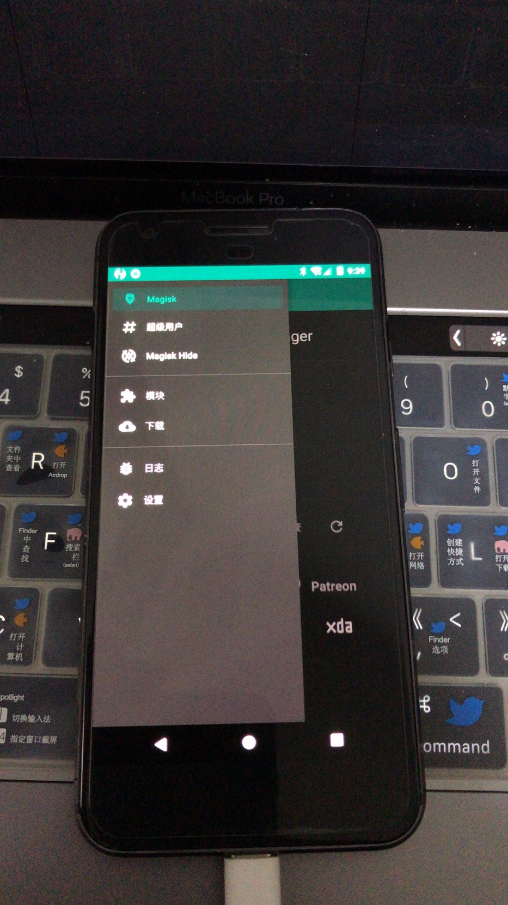

# 第八课 root教程(第三方root工具)
* 下载安装 [TWRP](https://twrp.me/Devices/)  与TWRP.img(版本要一致)这里是[google](https://twrp.me/Devices/Google/)

* 下载安装[su程序与管理程序](https://magiskmanager.com/)([github](https://github.com/topjohnwu/Magisk/releases))
* 分开安装
* 这里是举例操作流程，由于版本问题因此只能一个个试
```
adb install MagiskManager-v7.5.1.apk
adb push twrp-pixel-installer-sailfish-3.2.3-1.zip /data/local/tmp
adb reboot bootloader
fastboot boot twrp-3.2.3-1-sailfish.img
fastboot reboot
adb push Magisk-v20.3.zip /data/local/tmp 
adb reboot bootloader
fastboot boot twrp-3.2.3-1-sailfish.img
```
# 下面这里开始是成功的案例用的android8举例
* android8.0.0 系统 sailfish-opr6.170623.011
* Magisk版本 Magisk-v19.0.zip
* MagiskManager-v7.5.1.apk
* twrp-3.2.1-0-sailfish.img



```
/Users/haidragon/Downloads/android8.011
haidragon@liuhailongdeMacBook-Pro android8.011 % export PATH=$PATH:/Users/haidragon/Library/Android/sdk/platform-tools

haidragon@liuhailongdeMacBook-Pro android8.011 % ls
bootloader-sailfish-8996-012001-1706221457.img	flash-base.sh
flash-all.bat					image-sailfish-opr6.170623.011.zip
flash-all.sh					radio-sailfish-8996-013053-1708040002.img
haidragon@liuhailongdeMacBook-Pro android8.011 % adb reboot bootloader
haidragon@liuhailongdeMacBook-Pro android8.011 % ls  
bootloader-sailfish-8996-012001-1706221457.img	flash-base.sh
flash-all.bat					image-sailfish-opr6.170623.011.zip
flash-all.sh					radio-sailfish-8996-013053-1708040002.img
haidragon@liuhailongdeMacBook-Pro android8.011 % ./flash-all.sh 
Sending 'bootloader_a' (32268 KB)                  OKAY [  0.951s]
Writing 'bootloader_a'                             (bootloader) Valid bootloader version.
(bootloader) Flashing active slot "_a" 
(bootloader) Flashing active slot "_a" 
OKAY [ 13.611s]
Finished. Total time: 14.722s
Rebooting into bootloader                          OKAY [  0.010s]
Finished. Total time: 0.010s
Sending 'radio_a' (57288 KB)                       OKAY [  1.653s]
Writing 'radio_a'                                  OKAY [  0.888s]
Finished. Total time: 2.699s
Rebooting into bootloader                          OKAY [  0.035s]
Finished. Total time: 0.035s
--------------------------------------------
Bootloader Version...: 8996-012001-1706221457
Baseband Version.....: 8996-013053-1708040002
Serial Number........: FA6BG0304834
--------------------------------------------
extracting android-info.txt (0 MB) to RAM...
Checking 'product'                                 OKAY [  0.047s]
Checking 'version-bootloader'                      OKAY [  0.050s]
Checking 'version-baseband'                        OKAY [  0.050s]
Setting current slot to 'a'                        OKAY [  0.448s]
extracting boot.img (28 MB) to disk... took 0.147s
archive does not contain 'boot.sig'
Sending 'boot_a' (29109 KB)                        OKAY [  0.751s]
Writing 'boot_a'                                   OKAY [  0.655s]
archive does not contain 'dtbo.img'
archive does not contain 'dt.img'
archive does not contain 'recovery.img'
archive does not contain 'vbmeta.img'
archive does not contain 'vbmeta_system.img'
archive does not contain 'vendor_boot.img'
archive does not contain 'super_empty.img'
archive does not contain 'boot_other.img'
archive does not contain 'odm.img'
archive does not contain 'product.img'
extracting system.img (1834 MB) to disk... took 8.075s
archive does not contain 'system.sig'
Sending sparse 'system_a' 1/4 (518645 KB)          OKAY [ 13.798s]
Writing 'system_a'                                 OKAY [  7.956s]
Sending sparse 'system_a' 2/4 (489473 KB)          OKAY [ 12.753s]
Writing 'system_a'                                 OKAY [  6.567s]
Sending sparse 'system_a' 3/4 (500995 KB)          OKAY [ 13.754s]
Writing 'system_a'                                 OKAY [ 13.050s]
Sending sparse 'system_a' 4/4 (369138 KB)          OKAY [  9.408s]
Writing 'system_a'                                 OKAY [  4.246s]
archive does not contain 'system_ext.img'
extracting system_other.img (813 MB) to disk... took 3.781s
archive does not contain 'system.sig'
Sending sparse 'system_b' 1/2 (522640 KB)          OKAY [ 14.070s]
Writing 'system_b'                                 OKAY [  6.492s]
Sending sparse 'system_b' 2/2 (310892 KB)          OKAY [  8.398s]
Writing 'system_b'                                 OKAY [  4.708s]
extracting vendor.img (256 MB) to disk... took 1.319s
archive does not contain 'vendor.sig'
Sending 'vendor_a' (262597 KB)                     OKAY [  6.422s]
Writing 'vendor_a'                                 OKAY [  9.242s]
archive does not contain 'vendor_other.img'
Erasing 'userdata'                                 OKAY [  5.007s]
mke2fs 1.45.4 (23-Sep-2019)
Creating filesystem with 6509568 4k blocks and 1630208 inodes
Filesystem UUID: 79df5ae1-2c24-4543-b639-a9ccf79941e5
Superblock backups stored on blocks: 
	32768, 98304, 163840, 229376, 294912, 819200, 884736, 1605632, 2654208, 
	4096000

Allocating group tables: done                            
Writing inode tables: done                            
Creating journal (32768 blocks): done
Writing superblocks and filesystem accounting information: done   

Sending 'userdata' (4272 KB)                       OKAY [  0.118s]
Writing 'userdata'                                 OKAY [  0.102s]
Rebooting                                          OKAY [  0.050s]
Finished. Total time: 153.934s
haidragon@liuhailongdeMacBook-Pro android8.011 % adb install /Users/haidragon/Downloads/MagiskManager-v7.5.1.apk
error: no devices/emulators found
Performing Push Install
adb: error: failed to get feature set: no devices/emulators found
haidragon@liuhailongdeMacBook-Pro android8.011 % adb install /Users/haidragon/Downloads/MagiskManager-v7.5.1.apk
Performing Streamed Install
Success
haidragon@liuhailongdeMacBook-Pro android8.011 % adb push /Users/haidragon/Downloads/Magisk-v19.0.zip
adb: push requires an argument
haidragon@liuhailongdeMacBook-Pro android8.011 % adb push /Users/haidragon/Downloads/Magisk-v19.0.zip /data/local/tmp 
/Users/haidragon/Downloads/Magisk-v19.0.zip: 1 file pushed. 10.9 MB/s (4974225 bytes in 0.435s)
haidragon@liuhailongdeMacBook-Pro android8.011 % adb reboot bootloader
haidragon@liuhailongdeMacBook-Pro android8.011 % fastboot boot /Users/haidragon/Downloads/twrp-3.2.1-0-sailfish.img
Sending 'boot.img' (30948 KB)                      OKAY [  0.775s]
Booting                                            OKAY [  0.905s]
Finished. Total time: 1.709s
haidragon@liuhailongdeMacBook-Pro android8.011 % adb shell
sailfish:/ $ su
sailfish:/ # 
```


